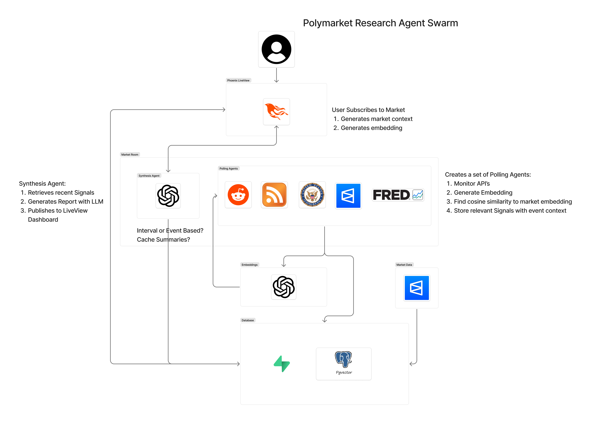
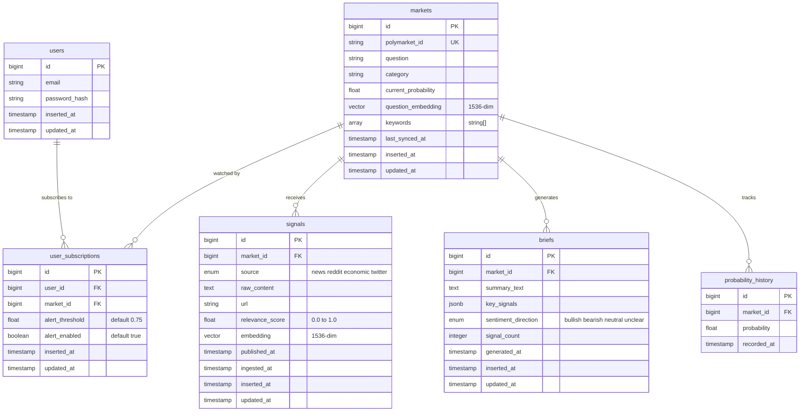

# Oracle

**AI-powered open-source intelligence aggregation for Polymarket prediction markets.**

Oracle lets you subscribe to any active Polymarket prediction market and immediately spin up a dedicated team of AI agents that continuously monitor news, Reddit, economic data, and social media for relevant signals — then synthesizes everything into a live intelligence brief on a real-time dashboard.

---

## The problem

Retail participants in prediction markets face an information asymmetry problem. Sophisticated traders have teams of analysts and automated tools monitoring signals around the clock. Individual traders do not. Market probabilities often shift before most participants have even seen the underlying news that caused the move.

There is no existing tool that connects directly to Polymarket's market structure, automatically identifies and aggregates relevant OSINT for a specific market, and delivers synthesized intelligence in real time.

## How it works

1. A user subscribes to an active Polymarket market (e.g. *"Will the Fed cut rates in June 2026?"*)
2. Oracle parses the market question and spawns a set of specialized polling agents — one per data source
3. Each agent continuously fetches signals from its source (news RSS, Reddit, FRED economic data, etc.)
4. Incoming signals are embedded via OpenAI and scored for relevance against the market question using cosine similarity
5. A synthesis agent periodically collects the highest-scoring signals and generates an AI intelligence brief via LLM
6. The brief, signals, and probability history are pushed to a live Phoenix LiveView dashboard via PubSub

---

## System architecture

Each subscribed market gets its own OTP supervision subtree. Agents are independent GenServers — if one crashes, it restarts without affecting siblings. The architecture is designed so adding a new data source is just implementing a behaviour and dropping it into the supervision tree.

<!-- Replace with your architecture diagram -->


*See [DESIGN.md](./docs/DESIGN.md) for full agent behaviour contracts, supervision tree structure, and error handling strategy.*

---

## Data model (ERD)

The core data model has six tables. `markets` is the central entity — signals, briefs, probability history, and user subscriptions all radiate from it. Signals store their embedding vectors (1536-dim via OpenAI `text-embedding-3-small`) for relevance scoring at ingest time via pgvector.



| Table | Purpose |
|---|---|
| `markets` | Polymarket market metadata, current probability, question embedding |
| `signals` | Every ingested OSINT signal, normalized across sources, with embedding + relevance score |
| `briefs` | Periodically generated AI synthesis for a market |
| `probability_history` | Time-series log of Polymarket probability for charting |
| `user_subscriptions` | Tracks which users are watching which markets, with alert thresholds |
| `users` | User accounts and authentication |

---

## Tech stack

| Layer | Technology | Why |
|---|---|---|
| Application | **Elixir / OTP** | Agent swarm maps directly to supervision trees and GenServers. Fault tolerance is built in. |
| Web framework | **Phoenix LiveView** | Real-time dashboard pushed via PubSub. No client-side polling. |
| Primary database | **Postgres + pgvector** | Persistent store for signals, markets, briefs. pgvector enables semantic similarity search. |
| Cache | **Redis** | Hot cache for latest briefs and signals per market. Reduces DB read load. |
| Embeddings | **OpenAI text-embedding-3-small** | $0.02/M tokens. Batch embedding calls for efficiency. |
| LLM synthesis | **Claude / OpenAI** | Generates structured intelligence briefs from scored signals. |

---

## Data sources

| Source | Agent | Poll interval | What it provides |
|---|---|---|---|
| News RSS feeds | `NewsAgent` | 5 min | Structured articles from AP, BBC, NPR, CNBC, etc. |
| Reddit | `RedditAgent` | 10 min | Community sentiment, crowd-sourced signals from category-relevant subreddits |
| FRED (Federal Reserve) | `EconomicAgent` | 1 hour | Macro indicators — CPI, unemployment, fed funds rate, Treasury yields |
| X / Twitter | `XAgent` | 15 min | Social signal and breaking news (mocked for initial dev due to API cost) |
| Polymarket API | `PolymarketAgent` | 2 min | Market metadata, current probabilities, price history (direct DB write, not a signal source) |

---

## UX sketches

<!-- Replace with your UX wireframes -->


---

## Daily goals

Project deadline: **April 15, 2026**

### Week 1 — Foundation (Mar 26 – Apr 1)

| Date | Goal | Hours |
|---|---|---|
| Mar 26 (Thu) | Finalize README, ERD, architecture diagram. Set up Elixir/Phoenix project scaffold with deps (Ecto, Redix, HTTPoison). | 3 |
| Mar 27 (Fri) | Polymarket API integration — fetch active markets, store in `markets` table. Basic market listing LiveView page. | 4 |
| Mar 28 (Sat) | Probability history sync — `PolymarketAgent` GenServer polling prices, writing to `probability_history`. | 3 |
| Mar 29 (Sun) | Buffer / catch-up day. | 2 |
| Mar 31 (Mon) | `NewsAgent` — RSS parsing, fetch from 3-4 feeds, normalize into raw signal structs. | 3 |
| Apr 1 (Tue) | OpenAI embeddings integration — `embed_and_score/2` helper. Embed market questions on insert. Embed + score news signals at ingest. Write scored signals to `signals` table. | 4 |

### Week 2 — Pipeline + Synthesis (Apr 2 – Apr 8)

| Date | Goal | Hours |
|---|---|---|
| Apr 2 (Wed) | `RedditAgent` — OAuth flow, subreddit polling by market category, signal normalization. | 4 |
| Apr 3 (Thu) | `EconomicAgent` — FRED API integration, series polling, change-detection (only push on new data). | 3 |
| Apr 4 (Fri) | `XAgent` mock implementation. Verify all 4 agents run concurrently under `MarketRoom.Supervisor`. | 3 |
| Apr 5 (Sat) | `SynthesisAgent` — timer-based trigger, SQL query for top signals, LLM prompt construction, brief generation and storage. | 4 |
| Apr 6 (Sun) | Redis caching layer — cache latest brief and hot signals per market. Cache-aside reads from LiveView. | 3 |
| Apr 7 (Mon) | End-to-end test: subscribe to a real market, watch agents poll, signals accumulate, brief generate. Debug the full loop. | 3 |
| Apr 8 (Tue) | Buffer / bug fixes from end-to-end testing. | 2 |

### Week 3 — UI + Polish + Presentation (Apr 9 – Apr 15)

| Date | Goal | Hours |
|---|---|---|
| Apr 9 (Wed) | LiveView dashboard — market detail page with signal feed (live-updating via PubSub). | 4 |
| Apr 10 (Thu) | Probability chart (time-series). Brief display panel. Wire PubSub so new briefs push to UI without refresh. | 4 |
| Apr 11 (Fri) | User subscriptions — subscribe/unsubscribe flow, `DynamicSupervisor` spawns/terminates market rooms on demand. | 3 |
| Apr 12 (Sat) | Alerts system — notify user when a signal above their threshold arrives. Basic auth (phx.gen.auth or simple). | 3 |
| Apr 13 (Sun) | Polish UI, fix edge cases, improve error handling. Record demo video / capture screenshots. | 3 |
| Apr 14 (Mon) | Write final report. Prepare presentation slides (3-10 min). System diagram with scaling characteristics. | 3 |
| Apr 15 (Tue) | **Due date.** Final push, submit. Present in class. | 2 |

**Total estimated hours: ~60**

---

## Running locally

```bash
# Prerequisites: Elixir 1.17+, Postgres 16+ with pgvector, Redis

# Clone and setup
git clone https://github.com/YOUR_USERNAME/oracle.git
cd oracle
mix setup

# Configure API keys in .env
cp .env.example .env
# Add: OPENAI_API_KEY, REDDIT_CLIENT_ID, REDDIT_CLIENT_SECRET, FRED_API_KEY

# Start the server
mix phx.server

# Visit http://localhost:4000
```

---

## Project documents

- [Initial Project Summary](./project_summary.md)
- [Agent Architecture & Data Source Design](./docs/DESIGN.md)
- [Progress Log](./work_log.md)

---

## Key learnings

*To be filled in as the project progresses — targeting at least 3 key learnings for the final presentation.*

---

## License

MIT
